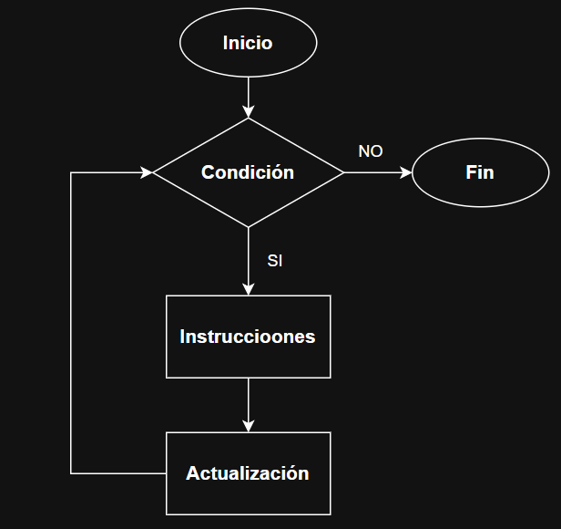
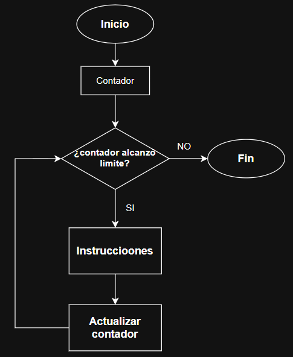
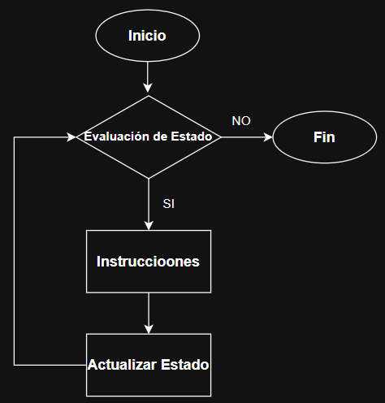

# Ciclos en Programación

## 1. El ciclo como estructura de control

Un ciclo (o bucle) es una estructura de control que permite repetir un conjunto de instrucciones mientras se cumpla una condición lógica.

Todo ciclo se compone de tres elementos fundamentales:

- **Condición:** Determina si el ciclo continúa o finaliza.
- **Bloque de instrucciones:** Conjunto de acciones que se repiten.
- **Actualización:** Modificación de variables para evitar ciclos infinitos.

---

## 2. Representación conceptual del ciclo

Un ciclo puede entenderse como una estructura que responde constantemente a la pregunta:

“¿Se debe repetir nuevamente el proceso?”

Para visualizar esto, inserte el siguiente diagrama:

---

## 3. Tipos de ciclos

### 3.1 Ciclos determinados

Son aquellos en los que se conoce previamente cuántas veces se repetirá el proceso.

**Características:**
- Se controlan con un contador.
- El número de iteraciones es fijo.
- La condición depende de un valor numérico.
- La actualización modifica el contador.

**Estructura mental:**
“Repetir un número específico de veces”

---

### 3.2 Ciclos indeterminados

Son aquellos en los que no se conoce previamente cuántas veces se repetirá el proceso.

**Características:**
- Se controlan mediante un estado.
- El número de iteraciones es variable.
- Dependen de condiciones externas o situaciones.
- La actualización modifica el estado.

**Estructura mental:**
“Repetir mientras se cumpla una condición”

---

## 4. Diferencia fundamental entre ambos tipos

La diferencia principal radica en el criterio de control:

- Ciclos determinados → dependen de un **contador**
- Ciclos indeterminados → dependen de un **estado**

En términos conceptuales:

- Determinado: ¿Cuántas veces repetir?
- Indeterminado: ¿Hasta cuándo repetir?

---

## 5. Ejemplos de situaciones reales

### Ciclos determinados

- Repetir una rutina de ejercicio 10 veces  
  - Tipo: Determinado  
  - Contador: 10 repeticiones  

- Registrar asistencia de 30 estudiantes  
  - Tipo: Determinado  
  - Contador: 30 estudiantes  

- Hornear 4 bandejas  
  - Tipo: Determinado  
  - Contador: 4 bandejas  

---

### Ciclos indeterminados

- Ahorrar dinero hasta alcanzar $1000  
  - Tipo: Indeterminado  
  - Estado: dinero acumulado  

- Intentar una contraseña hasta acertar  
  - Tipo: Indeterminado  
  - Estado: contraseña correcta/incorrecta  

- Esperar el autobús hasta que llegue  
  - Tipo: Indeterminado  
  - Estado: llegada del autobús  
---
## ¿Qué es un diagrama de flujo?

Un diagrama de flujo es una representación gráfica de un proceso o algoritmo. Utiliza **símbolos estandarizados** para mostrar cada paso del proceso y las decisiones que se toman.

### Principales elementos de un diagrama de flujo

| **Símbolo**            | **Nombre técnico**           | **Función**                                                  |
|------------------------|------------------------------|--------------------------------------------------------------|
| 🔷 Rombos              | **Decisión**                 | Representa una pregunta o condición con dos o más salidas.   |
| ⬛ Rectángulos         | **Proceso o Acción**         | Representa una instrucción o paso del proceso.               |
| 🟠 Elipses             | **Inicio / Fin (Terminal)**  | Indica el punto de inicio o fin del diagrama.                |
| 🔲 Paralelepípedo      | **Entrada/Salida**           | Representa una operación de entrada o salida de datos.       |
| 🔀 Flechas             | **Líneas de flujo**          | Indican la dirección del proceso de un paso a otro.          |
---

## 6. Ejercicios propuestos

### Ejercicio 1: Ahorro
Una persona quiere guardar dinero para comprar una bicicleta que cuesta $800.

El sistema debe:

Solicitar al usuario cuánto dinero desea ahorrar en cada intento.
Acumular el dinero ingresado.
Mostrar el total ahorrado después de cada depósito.
Repetir el proceso hasta que el total sea mayor o igual a $800.
Mostrar un mensaje de logro al alcanzar la meta.
Tipo de ciclo: Indeterminado
Estado: Total ahorrado respecto a la meta ($800)

---

### Ejercicio 2: Asistencia

Un docente necesita registrar la asistencia de 30 estudiantes.

El sistema debe:

Repetir el proceso 30 veces.
En cada repetición, pedir si el estudiante está presente o ausente.
Llevar un conteo de estudiantes presentes.
Al final, mostrar el total de asistentes.
Tipo de ciclo: Determinado
Contador: Número de estudiantes (30)

---

### Ejercicio 3: Validación de Contraseña

Un sistema requiere que el usuario ingrese una contraseña correcta para acceder.

El sistema debe:

Solicitar la contraseña.
Verificar si es correcta.
Si no es correcta, volver a pedirla.
Repetir el proceso hasta que la contraseña sea válida.
Mostrar un mensaje de acceso concedido.
Tipo de ciclo: Indeterminado
Estado: Validez de la contraseña (correcta/incorrecta)
---

### Ejercicio 4: Promedio

Un estudiante desea calcular el promedio de 5 calificaciones.

El sistema debe:

Solicitar 5 notas una por una.
Acumular las notas.
Al finalizar, calcular y mostrar el promedio.
Tipo de ciclo: Determinado
Contador: Número de notas (5)

---

### Ejercicio 5: Adivinanza

Un sistema monitorea la temperatura de una máquina.

El sistema debe:

Solicitar la temperatura actual.
Mostrar un mensaje si la temperatura es alta.
Repetir el proceso mientras la temperatura sea mayor a un valor seguro.
Finalizar cuando la temperatura esté dentro del rango permitido.
Tipo de ciclo: Indeterminado
Estado: Nivel de temperatura (segura/no segura)
---
### Ejercicio 6: Conteo de productos

En una tienda se registran los precios de 10 productos.

El sistema debe:

Solicitar el precio de cada producto.
Acumular el total.
Al final, mostrar el valor total de todos los productos.
Tipo de ciclo: Determinado
Contador: Número de productos (10)
---
### Ejercicio 7: Juego de adivinanza
El sistema tiene un número secreto.

El sistema debe:

Pedir al usuario que adivine el número.
Indicar si el número ingresado es correcto o no.
Repetir el proceso hasta que el usuario acierte.
Mostrar un mensaje de éxito al acertar.
Tipo de ciclo: Indeterminado
Estado: Adivinanza correcta/incorrecta
---

### Ejercicio 8: Repetición de una tarea
Un operario debe revisar 8 cajas en una línea de producción.

El sistema debe:

Repetir el proceso 8 veces.
En cada iteración, indicar que se está revisando una caja.
Al finalizar, mostrar que todas las cajas han sido revisadas.
Tipo de ciclo: Determinado
Contador: Número de cajas (8)
---
### Recomendaciones para los estudiantes de Mental Code
Para cada ejercicio, el diagrama de flujo debe incluir:

Inicio y fin
Entrada de datos
Proceso (cálculos o acumulaciones)
Decisión (condición del ciclo)
Flechas que representen correctamente la repetición

Se recomienda identificar primero:

Qué se repite
Qué condición controla el ciclo
Qué cambia en cada iteración

Esto facilita la construcción correcta del diagrama.